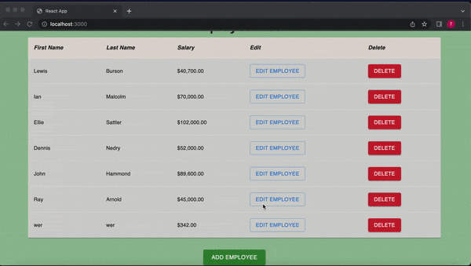

<h1 align="center">Welcome to the Employees Table 👋</h1>
<p>

#### A simple web application that fetches data of company's employees from a JSON file and presents them on table.
#### In addition, the user could: Add, edit, or delete employees.
</p>




## 🚀 Features

-   User is able add new employees.

-   User is able edit employees.

-   User is able delete employees.

-   Salary information is displayed in currency format.

##  Technologies and Libraries Used:

-   ReactJS
-   Bootstrap
-   Material-UI

## Install

```sh
git clone git@github.com:Sohaib-GO/EmployeesTable-React.git

cd employee-table

npm install

```

## Usage

```sh
npm run start
```


## Author

👤 **Sohaib**

* Github: [@Sohaib-GO](https://github.com/Sohaib-GO)

